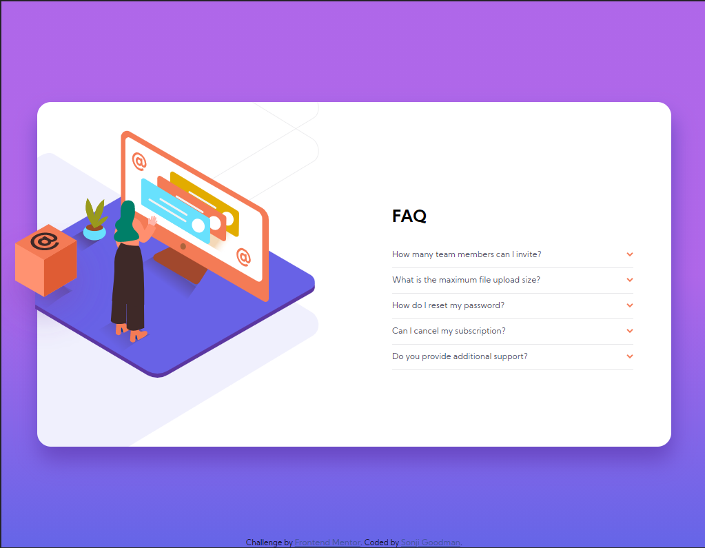

# Frontend Mentor - FAQ accordion card solution<!-- omit in toc -->

This is a solution to the [FAQ accordion card challenge on Frontend Mentor](https://www.frontendmentor.io/challenges/faq-accordion-card-XlyjD0Oam). Frontend Mentor challenges help you improve your coding skills by building realistic projects. 

## Table of contents

- [Table of contents](#table-of-contents)
- [Overview](#overview)
  - [The challenge](#the-challenge)
  - [Screenshot](#screenshot)
    - [MOBILE](#mobile)
    - [DESKTOP](#desktop)
  - [Links](#links)
- [My process](#my-process)
  - [Built with](#built-with)
  - [What I learned](#what-i-learned)
  - [Continued development](#continued-development)
  - [Useful resources](#useful-resources)
- [Author](#author)


## Overview

### The challenge

Users should be able to:

- View the optimal layout for the component depending on their device's screen size
- See hover states for all interactive elements on the page
- Hide/Show the answer to a question when the question is clicked

### Screenshot

#### MOBILE


#### DESKTOP



### Links

- Solution URL: [Add solution URL here](https://your-solution-url.com)
- Live Site URL: [Add live site URL here](https://your-live-site-url.com)

## My process

### Built with

- Semantic HTML5 markup
- CSS custom properties
- Vanilla JavaScript
- Flexbox
- CSS Grid
- Mobile-first workflow


### What I learned

One of the things that was a challenge was to change the main illustration (to change to the Desktop version of the illustration when the user is viewing it on Desktop). I read about Responsive Images on the MDN, and saw a solution involving using the `<picture>` tag, then nesting `<source>` tags containing which version of the illustration to use based on screen size:

```html
<picture>
          <source
            media="(max-width: 1023px)"
            srcset="images/illustration-woman-online-mobile.svg"
          />
          <source
            media="(min-width: 1024px)"
            srcset="images/illustration-woman-online-desktop.svg"
          />
          
        </picture>
```


### Continued development

I would like to explore more opportunities to use the `<picture>` tag. 

Also, I would like to practice more with doing Accordion Menus with arrows in JavaScript.

Finally, the questions were hard-coded into the HTML. When I revisit this, I'll put them into a seperate JavaScript file and map through each question and display to the user.


### Useful resources


- [Responsive images](https://developer.mozilla.org/en-US/docs/Learn/HTML/Multimedia_and_embedding/Responsive_images#art_direction) - this section in particular, Art Direction, discusses how to change the image using the `<picture>` tag in the HTML


- [CSS clip-path maker](https://bennettfeely.com/clippy/) - helped with clipping the left side of the image in the Desktop view


## Author

- Website - [Sonji Goodman](https://www.sonjigoodman.com)
- Frontend Mentor - [@Infinity-Mineeva](https://www.frontendmentor.io/profile/Infinity-Mineeva)


